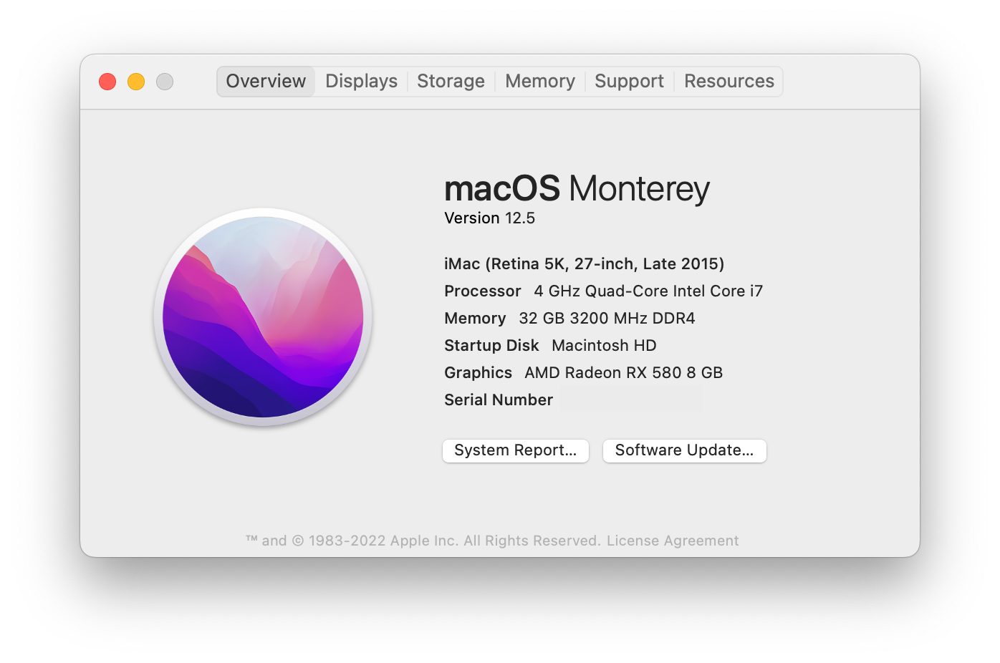

# 华硕Z170i Pro Gaming黑苹果Opencore

本EFI可在macOS Monterey (12.5)上驱动。FCPX显卡渲染正常工作。HDR可正常开启。支持睡眠，隔空投送和接力。

## 注意事项
1. 加入Mac启动音效。根据主板的不同，可能需要修改‘config.plist/UEFI/Audio/AudioOut’。
2. 如果没有独显，请参考这个分支 [HD530](https://github.com/BrushXue/Z170i-Pro-Gaming-OpenCore/tree/HD530).
3. 我在USB映射里面加满了15个端口。2个USB 3.0(前置) + 4个USB 3.0(后置) + 2个USB 2.0(后置) + 蓝牙(内部M.2) = 15个端口。一般情况下ITX机箱没有前置USB 2.0接口所以我没有添加板载USB 2.0(HS11/HS12)。这项设定应该符合绝大多数人的需求。但如果你选购了一些奇奇怪怪的需要单独连USB 2.0的无线网卡, 参考[这里](https://dortania.github.io/USB-Map-Guide/)创建自己的USB映射。
4. 板载声卡3.5mm输出需要接在绿色（LINE OUT）插孔上面。如果从Windows系统重新启动会没有声音，这是华硕声卡驱动的问题。每次从Windows重启进入macOS时请先关机再开机。

## 硬件
| 类别 | 品牌 | 型号 | 驱动 | 备注 |
|-----|-----|-----|-----|-----|
| 主板 | 华硕 | Z170i Pro Gaming | | |
| 处理器 | 英特尔 | i7-6700K |  | |
| 内存 | 芝奇 | TridentZ 2x16GB DDR4 3000 |  | 超频至 3200 |
| 核芯显卡 | 英特尔 | HD Graphics 530 | 免驱 | Headless模式 |
| 独立显卡 | 蓝宝石 | Pulse RX580 8GB | 免驱 | 2304流处理器 |
| 固态硬盘 | 三星 | SM961 1TB NVMe | [NVMeFix](https://github.com/acidanthera/NVMeFix) | |
| 无线 | 博通 | BCM94360NG M.2 | 免驱 | 替换QCA61x4A* |
| 以太网 | 英特尔 | I219-V | [IntelMausi](https://github.com/acidanthera/IntelMausi) | |
| 声卡 | 瑞昱 | ALC1150 | [AppleALC](https://github.com/acidanthera/AppleALC) | |
| 电源 | 海盗船 | SF600 白金版 | | |
| 机箱 | Dan | A4-SFX | | |
| 显示器 | 戴尔 | U2720Q | | |

*高通的QCA61x4A无解，请参见[此教程](https://www.tonymacx86.com/threads/bcm94352z-installed-on-asus-z170i-pro-gaming-wifi-and-bt.191274)替换原厂无线网卡。理论上BCM94352Z或BCM94360CS2加转接卡都可以免驱使用。
## BIOS设置
| 名称 | 选项 |
| --- | --- |
| SW Guard Extensions (SGX) | 关闭 |
| CFG Lock | 关闭 |
| VT-d | 关闭 |
| 大于4G地址空间解码 | 开启 |
| 首选显卡 | PCIE |
| 初始化iGPU | 开启 |
| DVMT Pre-Allocated | 128M |
| IOAPIC 24-119 Entries | 关闭 |
| 网络堆栈 | 关闭 |
| Legacy USB 支持| 开启 |
| 快速启动 | 关闭 |
| 操作系统类型 | 其他操作系统 |
| 开启CSM | 关闭 |
